  

 

  
  
  

 

 

  <h3>⚡ AI Agent Orchestration // CRM Architect // Growth Traffic Engineering</h3>
  
Movo-me na interseção exata entre a Inteligência Artificial e a automação de alta performance. Meu foco é arquitetar sistemas que integram IA a funis de tráfego e CRM, criando fluxos inteligentes que escalam negócios de forma autônoma e eficiente.

 

 

## 📊 System Diagnostics & Activity

  
  

 

