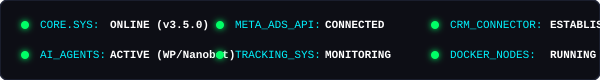
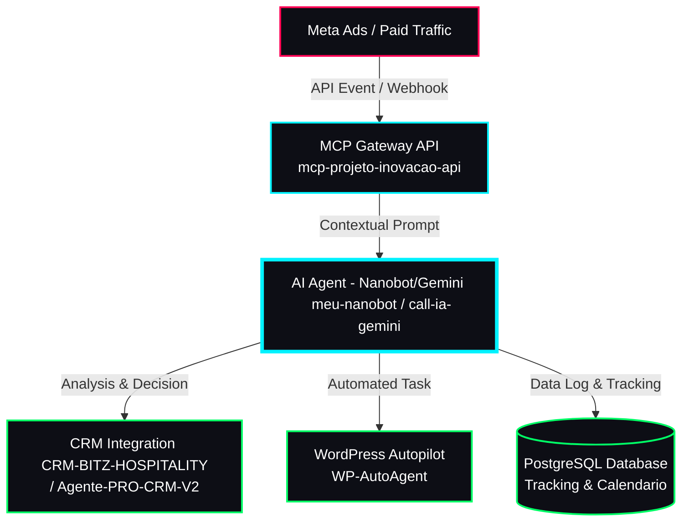

<div align="center">
  
</div>

<div align="center">
  
</div>

<div align="center">
  <a href="https://github.com/eberton-m-alvares" target="_blank"></a>
  <a href="https://linkedin.com/in/eberton-m-alvares" target="_blank"></a>
  <a href="mailto:ebertonalvares13@gmail.com" target="_blank"></a>
</div>

<br>

<br>

## 🖥️ System Status Dashboard
<p align="center">
  
</p>

<br>

<br>

## 🩸 Core Overview: Eberton M. Alvares

Movo-me na interseção exata entre a **Inteligência Artificial**, **arquitetura de sistemas** e **mídia paga**. Meu propósito é projetar e implantar agentes autônomos e conectores que resolvem fluxos operacionais, integram dados de campanhas e automatizam a retenção e conversão de leads de ponta a ponta.

```typescript
class EbertonAlvares extends Developer {
  readonly role        = "AI Architect & Full Stack Engineer";
  readonly specialties = ["AI Agents & LLMs", "CRM Automation", "Traffic Engine integrations"];
  readonly coreStack   = ["Python", "TypeScript", "C# / .NET", "PostgreSQL", "Docker"];

  async executeAutomatedFunnel(trafficEvent: MetaAdsEvent): Promise<Conversion> {
    const context = await MCPGateway.fetchContext(trafficEvent);
    const agent   = await AIAgent.initialize({ core: "Claude/Gemini" });
    const lead    = await agent.analyzeIntent(context);
    
    return await CRM.dispatch({
      target: "Agente-Pro-CRM",
      lead: lead,
      action: "auto-convert",
      status: "active"
    });
  }
}
```

<br>

<br>

## 🗺️ System Integration Blueprint

O diagrama abaixo ilustra como meus projetos reais se conectam para orquestrar campanhas e processos de forma inteligente:



<br>

<br>

## ⭐ Highlighted Projects

*   ⚡ **[meu-nanobot](https://github.com/eberton-m-alvares/meu-nanobot)**: Guia completo para deploy e customização segura do Nanobot AI Agent via Docker.
*   🤖 **[WP-AutoAgent](https://github.com/eberton-m-alvares/WP-AutoAgent)**: Script e automações integradas para simplificar a administração e operações no WordPress.
*   📈 **[gestor-de-trafego-meta](https://github.com/eberton-m-alvares/gestor-de-trafego-meta)**: Código de integração e análise para a API do Meta Ads.

<br>

<br>

## 📊 System Diagnostics & Activity

<p align="center">
  
  
</p>
